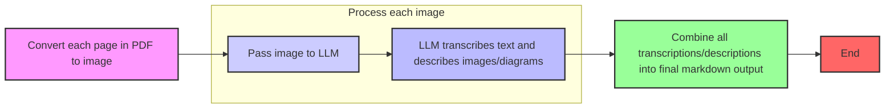
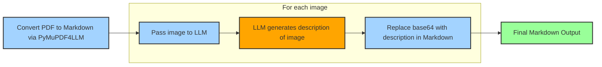

# PDF to Markdown Converter with Azure OpenAI

🚀 **Transform PDFs into clean, structured Markdown** using Azure OpenAI's vision capabilities. This repository provides two powerful approaches for converting PDF documents to Markdown format while preserving structure and handling visual content intelligently.

## 📋 Table of Contents
- [Overview](#overview)
- [Features](#features)
- [Architecture](#architecture)
- [Installation](#installation)
- [Configuration](#configuration)
- [Usage](#usage)
- [Approach Comparison](#approach-comparison)
- [Advanced Options](#advanced-options)
- [License](#license)

## 🎯 Overview

This project offers two distinct methods for converting PDFs to Markdown:

1. **Full Page Vision OCR** (`pdf_to_markdown_full_ocr.py`): Renders entire PDF pages as images and uses LLM vision to transcribe and structure content
2. **Hybrid Text + Image Description** (`pdf_to_markdown_with_image_descriptions.py`): Extracts text using PyMuPDF and replaces embedded images with AI-generated descriptions

Both approaches leverage Azure OpenAI's multimodal capabilities to handle text, tables, figures, and complex layouts.

## ✨ Features

- 📖 **Accurate text extraction** with layout preservation
- 🖼️ **Intelligent image handling** - converts charts, diagrams, and figures to descriptive text
- 📊 **Table structure preservation** in Markdown format
- 🎯 **Heading hierarchy detection** for proper document structure
- 📝 **Multiple formatting styles** support (bold, italic, lists, blockquotes)
- ⚡ **Configurable processing** with page ranges and quality settings
- 🔧 **Environment-based configuration** for easy deployment
- 📦 **Size-optimized image processing** with automatic quality adjustment

## 🏗️ Architecture

### Full Page Vision OCR Workflow



### Hybrid Text + Image Description Workflow



## 🔧 Installation

### Prerequisites
- Python 3.8+
- Azure subscription with Azure AI Projects access
- Azure OpenAI deployment (GPT-4 Vision recommended)

### Install Dependencies

```bash
# Clone the repository
git clone https://github.com/DanGiannone1/document_ingestion_for_genai.git
cd document_ingestion_for_genai

# Install required packages
pip install -r requirements.txt
```

**requirements.txt:**
```txt
pymupdf>=1.23.0
pymupdf4llm>=0.0.5
pillow>=10.0.0
azure-identity>=1.15.0
azure-ai-projects>=1.0.0
python-dotenv>=1.0.0
openai>=1.0.0
```

## ⚙️ Configuration

Create a `.env` file in the project root:

```env
# Required Azure AI configuration
PROJECT_ENDPOINT=https://your-project.openai.azure.com/
MODEL_DEPLOYMENT_NAME=gpt-4-vision-preview  # or your deployment name
AZURE_OPENAI_API_VERSION=2024-02-01

# Optional: Context window for image descriptions (Hybrid approach only)
VISION_CONTEXT_BEFORE_CHARS=400
VISION_CONTEXT_AFTER_CHARS=400
VISION_MAX_CONTEXT_CHARS=1000
```

### Azure Setup

1. Create an Azure AI Project in [Azure AI Studio](https://ai.azure.com)
2. Deploy a GPT-4 Vision model
3. Copy your project endpoint and deployment name
4. Ensure your Azure credentials are configured (Azure CLI, managed identity, or service principal)

## 📖 Usage

### Full Page Vision OCR Approach

Best for: **Scanned documents, complex layouts, handwritten text, or when maximum fidelity is needed**

```bash
# Basic usage
python pdf_to_markdown_full_ocr.py input.pdf

# Specify output file
python pdf_to_markdown_full_ocr.py input.pdf -o output.md

# Process specific pages
python pdf_to_markdown_full_ocr.py input.pdf --start 1 --end 10

# Without page headers
python pdf_to_markdown_full_ocr.py input.pdf --no-page-headings
```

### Hybrid Text + Image Description Approach

Best for: **Digital PDFs with embedded images, when you need faster processing**

```bash
# Basic usage
python pdf_to_markdown_with_image_descriptions.py input.pdf

# Specify output file
python pdf_to_markdown_with_image_descriptions.py input.pdf -o output.md
```

## 🔄 Approach Comparison

| Feature | Full Page Vision | Hybrid Approach |
|---------|-----------------|-----------------|
| **Method** | Renders entire pages as images | Extracts text, processes images separately |
| **Best For** | Scanned PDFs, complex layouts | Digital PDFs with clear text |
| **Accuracy** | Highest for all content types | High for text, depends on PyMuPDF for structure |
| **Processing Time** | Slower (full page vision) | Faster (only images use vision) |
| **Token Usage** | Higher (~3500 tokens/page) | Lower (varies by image count) |
| **Layout Preservation** | Excellent | Good |
| **Handwritten Text** | ✅ Supported | ❌ Not supported |
| **Image Handling** | Describes in context | Describes with surrounding text |
| **Page Range Selection** | ✅ Supported | ❌ Full document only |

## 🎛️ Advanced Options

### Full Page Vision Settings

Modify these constants in `pdf_to_markdown_full_ocr.py`:

```python
RENDER_DPI = 280                # Image quality (260-320 recommended)
MAX_IMAGE_BYTES = 20 * 1024**2  # Max size per page (20MB default)
JPEG_QUALITY_START = 85         # Initial JPEG quality
MIN_JPEG_QUALITY = 35           # Minimum before downscaling
DOWNSCALE_FLOOR_PX = 720        # Minimum edge size when downscaling
MAX_TOKENS_PER_PAGE = 3500      # LLM token limit per page
TEMPERATURE = 0.0               # LLM temperature (0 = deterministic)
```

### Output Format Examples

**Full Page Vision Output:**
```markdown
## Page 1

# Executive Summary

This document presents quarterly results...

**Key Metrics:**
- Revenue: $5.2M
- Growth: 23% YoY
- Customer satisfaction: 94%

IMAGE: Bar chart showing quarterly revenue trends from Q1-Q4 2024, with values 
ranging from $4.1M to $5.2M, showing steady upward progression

## Financial Overview

| Quarter | Revenue | Expenses | Profit |
|---------|---------|----------|--------|
| Q1      | $4.1M   | $3.2M    | $0.9M  |
| Q2      | $4.5M   | $3.3M    | $1.2M  |
...
```

**Hybrid Approach Output:**
```markdown
# Executive Summary

This document presents quarterly results...

**Key Metrics:**
- Revenue: $5.2M
- Growth: 23% YoY
- Customer satisfaction: 94%

> Image: Bar chart displaying quarterly revenue data for 2024. The chart shows 
> four bars representing Q1 through Q4, with values of $4.1M, $4.5M, $4.8M, 
> and $5.2M respectively. The bars are colored in gradient blue, with a trend 
> line indicating 23% year-over-year growth.

## Financial Overview
...
```

## 📄 License

This project is licensed under the MIT License - see the LICENSE file for details.

